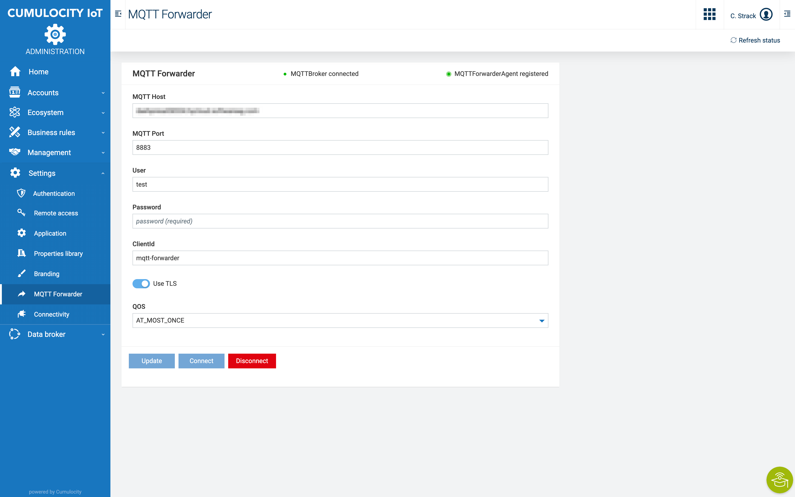

# Generic MQTT Forwarder Agent Microservice for Cumulocity


## Overview

Forward json payload send by POST request to a connected MQTT broker.
The endpoint for POST requests is  ```{{url}}/service/mqtt-forwarder/payload/{topic}```.

The connection to the MQTT broker is configured through the UI
.

______________________
These tools are provided as-is and without warranty or support. They do not constitute part of the Software AG product suite. Users are free to use, fork and modify them, subject to the license agreement. While Software AG welcomes contributions, we cannot guarantee to include every contribution in the master project.

Contact us at [TECHcommunity](mailto:technologycommunity@softwareag.com?subject=Github/SoftwareAG) if you have any questions.
