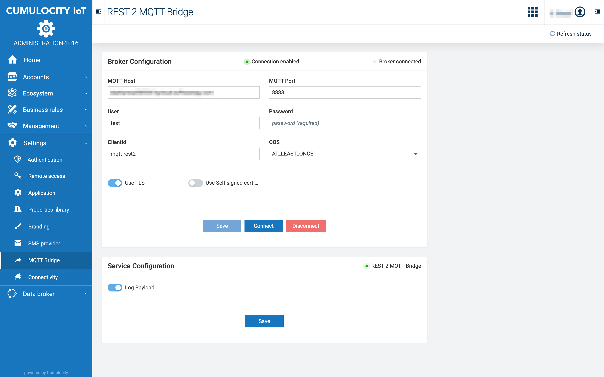
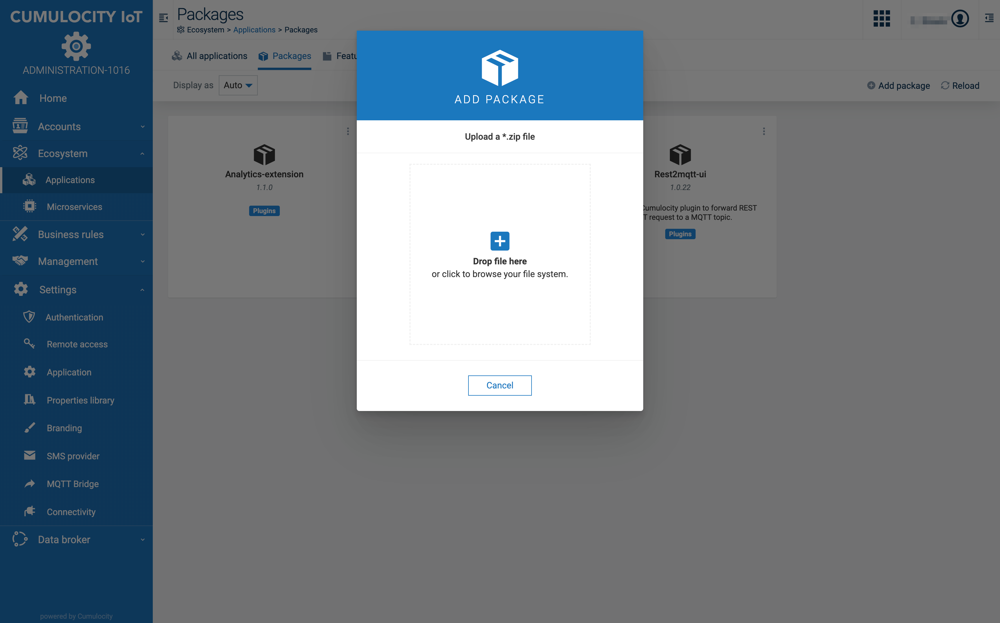
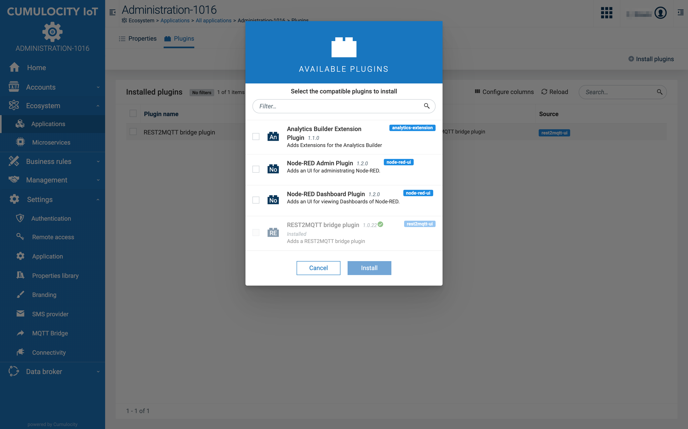

# REST to MQTT bridge (Cumulocity Microservice)


## Overview

Forward JSON payload send by POST request to a connected MQTT broker.
The endpoint for the POST requests is ```{{url}}/service/rest2mqtt/payload/{topic}```.

The connection to the MQTT broker is configured through the UI:


## Installation

The MQTT bridge is provied as a plugin for the Cumulocity Adaministration App. It requires Ui version > 1016.xx.
The web UI plugin is installed in two steps:
1. Upload the zip file ```rest2mqtt-ui.zip```
1. Install the plugin ```REST2MQTT bridge plugin``` to the administration app the zip file.

See the screenshots below.
Finally you have to install the microservice ```rest2mqtt-bridge.zip```






______________________
These tools are provided as-is and without warranty or support. They do not constitute part of the Software AG product suite. Users are free to use, fork and modify them, subject to the license agreement. While Software AG welcomes contributions, we cannot guarantee to include every contribution in the master project.

Contact us at [TECHcommunity](mailto:technologycommunity@softwareag.com?subject=Github/SoftwareAG) if you have any questions.
